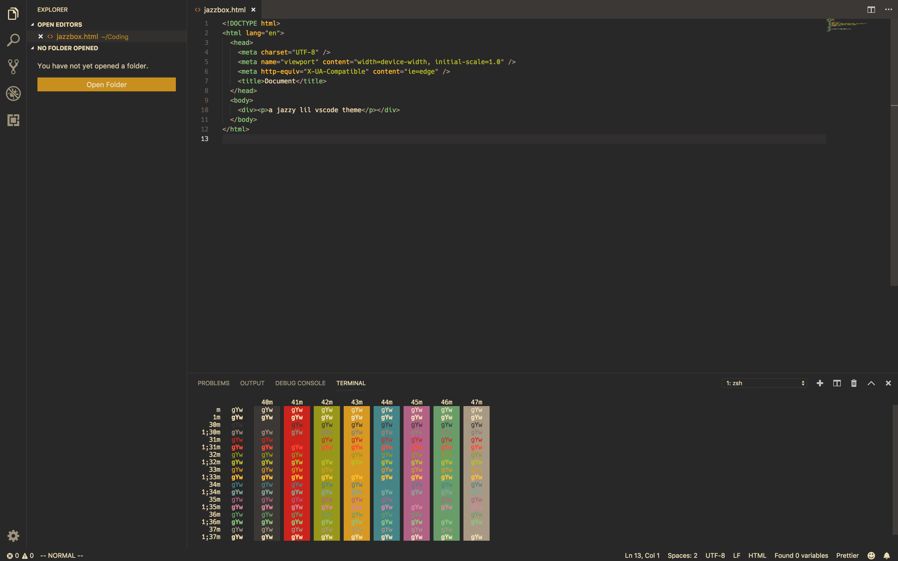

# jazzbox

> a jazzy vscode theme inspired by the gruvbox colorset

## Installing

add through the vscode extension marketplace in your editor.

alternatively, grab the vsix file [here](https://github.com/bvautour/jazzbox/releases/download/1.0.0/jazzbox-theme-1.0.0.vsix) and run `code --install-extension jazzbox-theme-1.0.0.vsix`
